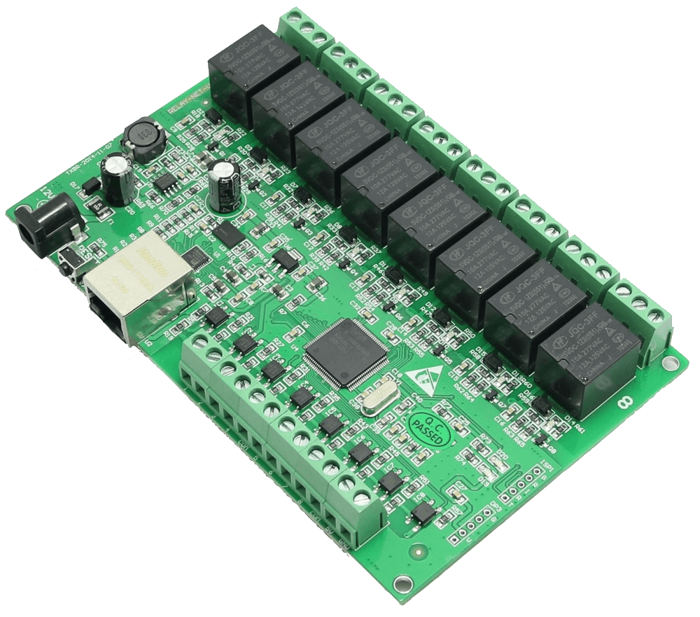

# Indigo 8 Channel Network Relay Board Plugin

This plugin allows you to control the relays on the 8 channel network relay boards
being sold on eBay. This plugin also exposes the 8 on-board input sensors. You may
find this plugin on the [Indigo Plugin Store](https://www.indigodomo.com/pluginstore/196/).

This repo includes two technical documents:
- [Ethnernet IO Controller V5  Instructions.pdf](docs/Ethnernet_IO_Controller_V5_Instructions.pdf)
- [ZM_TCP Protocol 1.0.pdf](docs/ZM_TCP_Proctocol_1.0.pdf) (misspelled on purpose?)

Both documents came from the retailer. Here's a link to the auction (until it goes away):
- [eBay: 8 Channel Relay Network IP Relay Web Relay Dual Control Ethernet RJ45 US SHIP](https://www.ebay.com/itm/262874035942)

## Board Image

## Will this work for you?

I have no idea. It works for me. Does your device listen on port 1234? If yes,
it'll probably work. Drop into a Terminal window on your Mac and run
`telnet 192.168.1.166 1234`. Replace 192.168.1.166 with your device's IP. If you
see `Trying 192.168.1.166...` and nothing else, it's not working. If it says
connected, type `DUMP` and hit enter. If you see data, you should be good to go!

## Usage

1. Clone this repo on your Indigo server.
2. Double-click the included plugin file.
3. Install and Enable the Plugin.
4. Add a New Device, Select 8 Channel Network Relay
5. Enter the IP address for your relay board.
6. Add 1 or more relays and click Save.
7. Click Edit Device Settings and select a Relay Channel for the device.
8. Click On and Off - your board should click.

There are a few more features, but that should get you going. Please report
any issues on GitHub.

## License

- [GPLv2](https://www.gnu.org/licenses/gpl-2.0.txt): See [LICENSE](LICENSE) File
